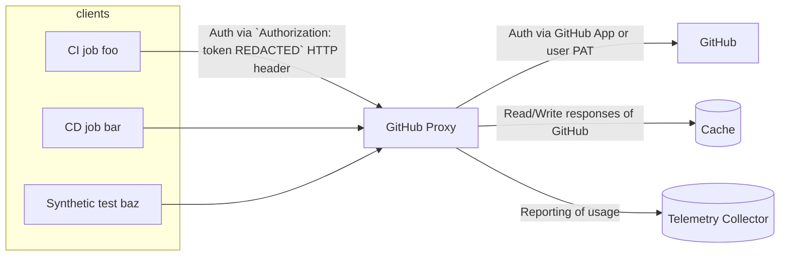

# github-proxy

[](https://circleci.com/gh/babylonhealth/github-proxy/tree/master) [](https://codeclimate.com/repos/6278f1a41d5c1a018e0037ff/maintainability) [](https://codeclimate.com/repos/6278f1a41d5c1a018e0037ff/test_coverage)

A caching forward proxy to GitHub's REST and GraphQL APIs. GitHub-Proxy is a thin, highly extensible, highly configurable python framework based on [Werkzeug](https://werkzeug.palletsprojects.com/) (and good intentions 😉). It comes with out-of-the-box support for Flask and Redis, but can be extended to integrate with other application frameworks, databases, and monitoring tools.

Features:

* Caching of GitHub responses based on [conditional requests](https://docs.github.com/en/rest/overview/resources-in-the-rest-api#conditional-requests).
* Improved and granular monitoring of client usage and [rate-limit](https://docs.github.com/en/rest/overview/resources-in-the-rest-api#rate-limiting) consumption.
* Provides a central and extensible pool of GitHub credentials (either GitHub Apps or user PATs) enabling the automatic rotation of rate-limited tokens. Negates the need of managing a GitHub App or bot user account per client.
* Coarse-grained and highly configurable authorization of clients based on API resource scopes.
* 100% compatible with GitHub's REST and GraphQL interfaces as well as the Enterprise Server.

## Install

Core framework:

```console
$ pip install github-proxy
```

With support for Redis as a cache backend:

```console
$ pip install github-proxy[redis]
```

With Flask support:

```console
$ pip install github-proxy[flask]
```

Docker image: *(Coming Soon)*

```console
$ docker pull babylonhealth/github-proxy
```

## Usage

Flask integration (see [example](./example.py)):

```python
from github_proxy import blueprint

app = Flask(__name__)

app.register_blueprint(blueprint)
app.register_blueprint(
    blueprint, name="github_enterprise_proxy", url_prefix="/api/v3"
)  # enterprise server

if __name__ == "__main__":
    app.run()
```

Core framework (only needed for non-Flask applications):

```python
# Explicitly construct a proxy instance
from github_proxy import Proxy, Config, CacheBackend, TelemetryCollector

config = Config()
proxy = Proxy(
    github_api_url=config.github_api_url,
    github_token_config=config,
    cache=CacheBackend.factory(config),
    rate_limited={},
    clients=config.clients,
    tel_collector=TelemetryCollector.from_type(config.tel_collector_type),
)

# Or inject an instance loaded from the environment
from github_proxy import inject_proxy
from werkzeug import Request, Response

@inject_proxy
def request_handler(proxy: Proxy, request: Request) -> Response:
    return proxy.request(request.path, request, "foo-client")
```

Registered clients (see [client registry file](#client-registry-file)) can then integrate with the proxy using their proxy client token. A proxy client token may be used as a regular GitHub PAT in [SAML SSO Authentication](https://docs.github.com/en/rest/overview/other-authentication-methods#authenticating-for-saml-sso):

```console
$ curl -H "Authorization: token ${CLIENT_TOKEN}" http://localhost:5000/zen
Keep it logically awesome.
```

## Architecture

The need for such a solution stemmed from Babylon's reliance on [GitOps](https://about.gitlab.com/topics/gitops/) as an operational and change release framework. This led to a high (and at times abusive) usage of the GitHub API through a limited number of GitHub bot users. Frequent rate-limiting and lack of observability in terms of which client/workflow/team is abusing the API resulted in suboptimal developer experience.

High usage clients of the GitHub API are usually CI/CD pipelines and automated tests. These workflows are traditionally implemented as a collection of job processes executing independently to each other. This setup does not allow hot resources (and their Etags) to be shared across different workflows, or even jobs of the same workflow.

The GitHub-Proxy provides a centralised store of Etags that can be shared and re-used amongst its client base, letting workflows take full advantage of [conditional requests](https://docs.github.com/en/rest/overview/resources-in-the-rest-api#conditional-requests) which do not count against the rate limit.



Sequence diagrams:

* [Cache hit](./docs/architecture/sequence-diagrams.md#cache-hit)
* [Cache miss](./docs/architecture/sequence-diagrams.md#cache-miss)

## Configuring the proxy

By default, the proxy loads its configuration using the `github_proxy.Config` class from the following 2 sources:

1. [Environment variables](#environment-variables)
2. [Client registry file](#client-registry-file)

### Environment variables

| Variable | Description | Default |
| - | - | - |
| `GITHUB_API_URL` | Base url of the GitHub API server. | `https://api.github.com` |
| `CACHE_TTL` | The TTL (in seconds) of the cache that stores GitHub responses. | `3600` |
| `CACHE_BACKEND_URL` | URI of the cache backend that stores GitHub responses. The scheme of the URI infers the cache backend type. | `inmemory://` |
| `GITHUB_CREDS_CACHE_MAXSIZE` | The max size of the inmemory cache used for storing rate limited GitHub credentials. | `256` |
| `GITHUB_CREDS_CACHE_TTL_PADDING` | The TTL padding (in minutes) of the inmemory cache used for storing rate limited GitHub credentials. This padding accounts for potential clock drift between the proxy and the GitHub servers. | `10` |
| `TELEMETRY_COLLECTOR_TYPE` | The type of telemetry collector to be used. | `noop` |
| `CLIENT_REGISTRY_FILE_PATH` (__Required__) | Path to the client registry file. See [here](#client-registry-file) for more. | n/a |
| `GITHUB_PAT_*` | Variable pattern to specify GitHub user PATs that the proxy can use when integrating with the GitHub API. Example variable name: `GITHUB_PAT_FOO`. | n/a |
| `GITHUB_APP_*_ID` | Variable pattern to specify GitHub App IDs that the proxy can use when integrating with the GitHub API. Example variable name: `GITHUB_APP_BAR_ID`. | n/a |
| `GITHUB_APP_*_INSTALLATION_ID` | Variable pattern to specify the GitHub App installation IDs that correspond to each of the GitHub App IDs. Example variable name: `GITHUB_APP_BAR_INSTALLATION_ID`.| n/a |
| `GITHUB_APP_*_PEM` | Variable pattern to specify the GitHub App private keys that correspond to each of the GitHub App IDs. Example variable name: `GITHUB_APP_BAR_PEM`. | n/a |

### Client registry file

This file specifies the set of clients that are authorized to integrate with the proxy:

```yaml
---
version: 1
clients:
  - name: test
    token: H+hYxlecgRq7yfmhq2COlJk7tpSwDmdsp8thdPsnbnQ=
  - name: read_only
    token: oed4+Uo4s4mgwstjSAY/N+HSOsGwfbX91QxqSOjsVlU=
    scopes:
    - method: GET
      path: .*
...
```

The tokens included in this file are the authorization tokens that clients need to pass to the proxy (instead of GitHub tokens). The name of each client should be unique and is to be used for telemetry purposes. The scopes define the resources and methods of the REST API that each of the clients is authorized to access (default to full access).

Tokens within this file must be treated as secrets. Since secrets cannot be commited to VCS, the registry file can also be provided as a [Jinja2](https://jinja.palletsprojects.com/en/3.1.x/) template, enabling the injection of secrets at runtime through env variables:

```jinja
version: 1
clients:
  - name: test
    token: {{ env.TOKEN_TEST }}
```

## Extending the proxy

Adding a new type of cache backend:

```python
from github_proxy import CacheBackend, CacheBackendConfig

class PostgresCacheBackend(CacheBackend, scheme="postgres"):
    # Implement the __init__, _get, _set, and _make_key methods
    # of the CacheBackend interface
    pass
```

Adding a new type of telemetry collector:

```python
from github_proxy import TelemetryCollector

class JaegerTelemetryCollector(TelemetryCollector, type_="jaeger"):
    # Implement the collect_gh_response_metrics and collect_proxy_request_metrics 
    # methods of the TelemetryCollector interface
    pass
```

Once imported, the above extensions can be selected using the respective `CACHE_BACKEND_URL` and `TELEMETRY_COLLECTOR_TYPE` env variables.

## Relevant references

1. [Google's magic GitHub proxy](https://github.com/google/magic-github-proxy): Proxy that enables IAM for GitHub API tokens.
2. [Sourcegraph's GitHub proxy](https://github.com/sourcegraph/sourcegraph/tree/main/cmd/github-proxy): Provides enhanced observability.
