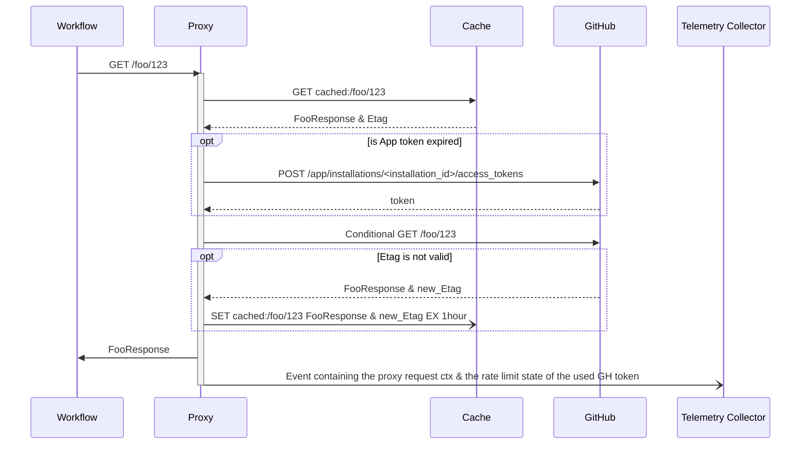
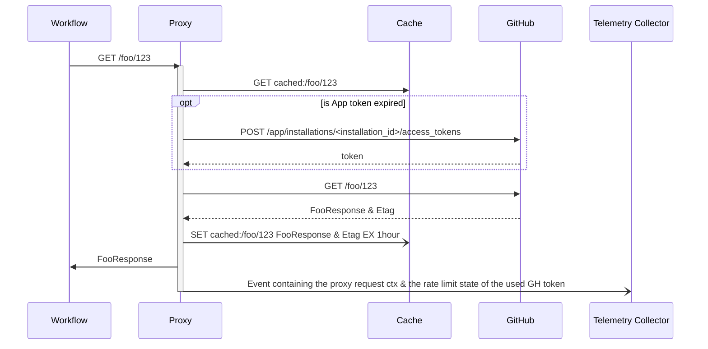

# Sequence Diagrams

##  Cache hit

```mermaid
sequenceDiagram
    participant Workflow
    participant Proxy
    participant Cache
    participant GitHub
    participant Telemetry Collector

    Workflow->>Proxy: GET /foo/123
    activate Proxy
    Proxy->>Cache: GET cached:/foo/123
    Cache-->>Proxy: FooResponse & Etag
    opt is App token expired
        Proxy->>GitHub: POST /app/installations/<installation_id>/access_tokens
        GitHub-->>Proxy: token
    end
    Proxy->>GitHub: Conditional GET /foo/123
  
    opt Etag is not valid
      GitHub-->>Proxy: FooResponse & new_Etag
      Proxy-)Cache: SET cached:/foo/123 FooResponse & new_Etag EX 1hour
    end
  
    Proxy->>Workflow: FooResponse
    Proxy-)Telemetry Collector: Event containing the proxy request ctx & the rate limit state of the used GH token
    deactivate Proxy
```

##  Cache miss

```mermaid
sequenceDiagram
    participant Workflow
    participant Proxy
    participant Cache
    participant GitHub
    participant Telemetry Collector

    Workflow->>Proxy: GET /foo/123
    activate Proxy
    Proxy->>Cache: GET cached:/foo/123
    opt is App token expired
        Proxy->>GitHub: POST /app/installations/<installation_id>/access_tokens
        GitHub-->>Proxy: token
    end
    Proxy->>GitHub: GET /foo/123
    GitHub-->>Proxy: FooResponse & Etag
    Proxy-)Cache: SET cached:/foo/123 FooResponse & Etag EX 1hour
    Proxy->>Workflow: FooResponse
    Proxy-)Telemetry Collector: Event containing the proxy request ctx & the rate limit state of the used GH token
    deactivate Proxy
```
